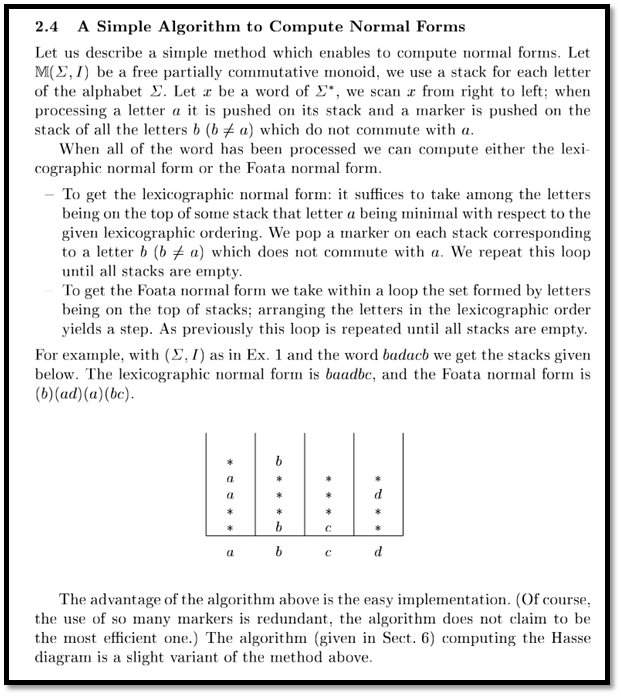
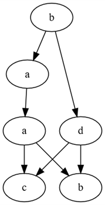
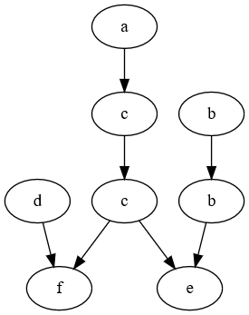

# Generacja klas Foaty i grafu Diekerta przy użyciu elementów funkcyjnych języka Scala
## Teoria
Do generacji klas Foaty bez grafu użyto algorytmu ze strony 10 z publikacji **V. Diekert, Y. M ́etivier – Partial commutation and traces, \[w:] Handbook of Formal Languages, Springer, 1997**


## Przykłady
### Przykład 1
Przykładowe wejście (plik `src/main/resources/test.txt`):
```
a b c d
baadcb
x := x + y
y := y + 2z
x := 3x + z
z := y - z
```

Wyjście (konsola):
```
D = { sym {(a,a), (a,b), (a,c), (b,b), (b,d), (c,c), (c,d), (d,d)} }
I = { sym {(a,d), (b,c)} }
Klasy na podstawie slowa: [b][a, d][a][b, c]
<graf wygenerowany do pliku src/main/resources/graph.txt>
Klasy na podstawie grafu: [b][a, d][a][c, b]
```

Wyjście (plik `src/main/resources/graph.txt`):
```
digraph g{
0 -> 1
1 -> 2
0 -> 3
2 -> 4
3 -> 4
2 -> 5
3 -> 5
0[label=b]
1[label=a]
2[label=a]
3[label=d]
4[label=c]
5[label=b]
}
```

Wizualizacja grafu w Graphviz:


### Przykład 2
Przykładowe wejście (plik `src/main/resources/test2.txt`):
```
a b c d e f
acdcfbbe
x := x + 1
y := y + 2z
x := 3x + z
w := w + v
z := y - z
v := x + v
```

Wyjście (konsola):
```
D = { sym {(a,a), (a,c), (a,f), (b,b), (b,e), (c,c), (c,e), (c,f), (d,d), (d,f), (e,e), (f,f)} }
I = { sym {(a,b), (a,d), (a,e), (b,c), (b,d), (b,f), (c,d), (d,e), (e,f)} }
Klasy na podstawie slowa: [a, b, d][b, c][c][e, f] 
<graf wygenerowany do pliku src/main/resources/graph2.txt>
Klasy na podstawie grafu: [a, d, b][c, b][c][f, e]
```

Wyjście (plik `src/main/resources/graph2.txt`):
```
digraph g{
0 -> 1
1 -> 3
2 -> 4
3 -> 4
5 -> 6
3 -> 7
6 -> 7
0[label=a]
1[label=c]
2[label=d]
3[label=c]
4[label=f]
5[label=b]
6[label=b]
7[label=e]
}
```

Wizualizacja grafu w Graphviz:


